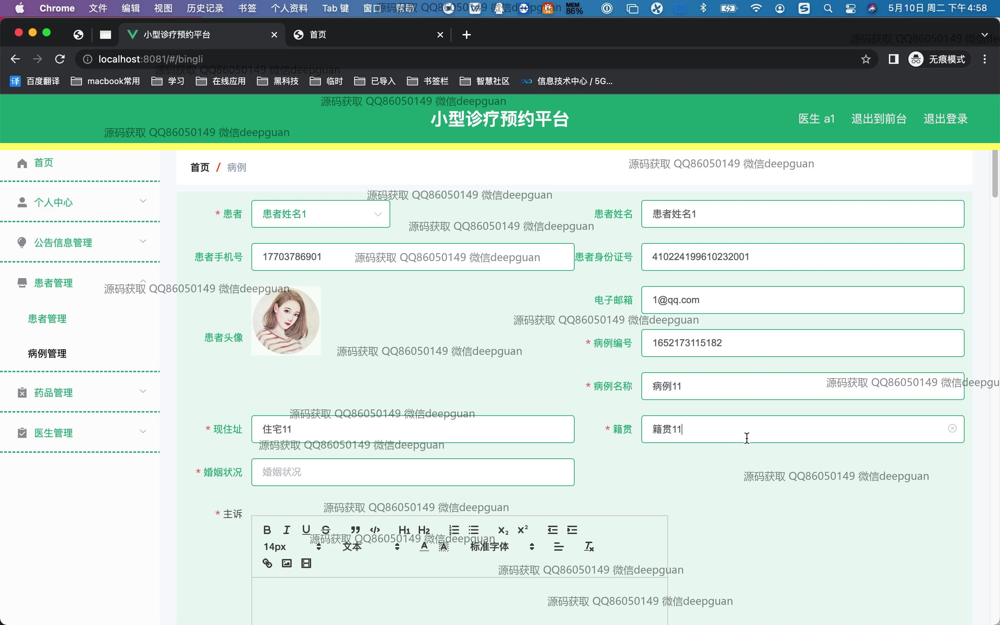
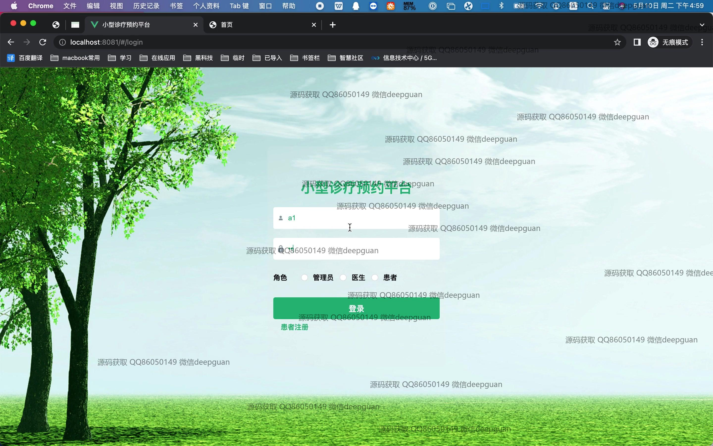

<h1 align="center">基于spring boot的小型诊疗预约平台的设计与开发</h1>

## 简介
基于Spring Boot的小型诊疗预约平台：角色分为管理员、医生及患者；支持用户登录注册、医生预约、个人信息管理及历史记录查看；提供后台管理、医生信息维护和药方开具等功能，提升医疗服务的便捷和效率。    --计算机毕业设计源码；毕设源码；java毕业设计源码

## 联系方式

<h3 align="center">获取完整代码与数据库文件 + 微信：deepguan QQ: 86050149 QQ群: 783742310</h3>

<h3 align="center">可帮忙远程部署 包运行成功！提供远程部署、修改代码、设计文档指导、代码讲解等服务！</h3>

## 功能介绍（完整见运行截图）
管理员：基本功能包括登录、注册和退出操作，采用Spring Boot架构平台进行后台管理。平台内的模块化设计允许管理员在个人中心管理和编辑公告信息，患者和病历记录，以及药品和医生的详细资料。管理员可调整病例信息，处理医生收藏项，并能在系统内进行公告信息管理、基础数据更新以及患者预约的全流程监控与管理。

医生：医生通过登录平台可以查看自己的预约情况，管理患者记录，并开具药方。平台提供个人信息编辑功能，使医生能够更新个人简介、联系方式、科室和职位信息。医生能通过系统直接与患者互动，包括回复留言和管理患者的反馈，通过大数据分析改善个人诊疗服务。

患者：平台提供注册和登录功能，支持患者查找和预约医生，查看医生详细信息，包含专长和评价功能。在个人中心，患者可更新个人资料和医疗记录，处理挂号订单，并查看用药和治疗历史。患者拥有查看和管理自己参与的预约记录的能力，并可借助平台反馈系统与医生进行交流沟通。

开发者：用于开发诊疗预约平台的工具和技术包括Spring Boot框架，IntelliJ IDEA集成开发环境，Postman进行API测试，SmartGit进行源代码版本控制。开发者在设计阶段可利用搭建的模拟测试环境，如VMware Fusion，确保系统功能的可靠性和用户体验的优化。同时，后台管理接口清晰，便于后续功能升级和系统维护。

## 运行截图

本代码来源于网络,仅供学习参考使用!

